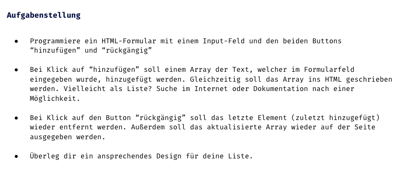

Aufgabenstellung

Das heutige Projekt ist eine
Teilnehmerliste.

## 💡 Assets

Es darf auf CSS für die Formatierung zurückgegriffen werden

Denkt an das .innerHTML oder .innerText -Attribut, um Inhalte ins HTML zu schreiben

mit der .toString()-Methode lässt sich ein Array zu einer Zeichenkette konvertieren. Hierbei verliert man jedoch die Möglichkeit, die einzelnen Elemente als Liste zu formatieren, indem man jedes Element in ein <li>-Tag packt.

mit der .join()-Methode lassen sich einzelne Array-Elemente zu einem String verbinden. Als Parameter kann ein Separator (z.B. ein Komma: ‘,’), mitgegeben werden.

## 📸 Screenshots

## 💻 Running

Zur Seite —> - [Lev2_3_js-vertiefung_arrays_teilnehmerliste](https://jennijennina.github.io/Teilnehmerliste_Array_Vertiefung/)

<h3 align="left">Languages and Tools:</h3>

 
 
 

